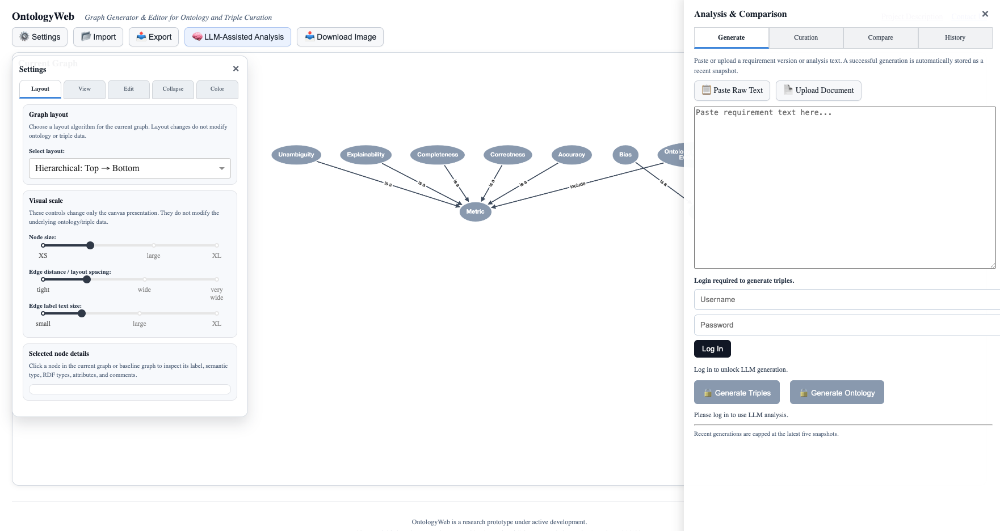
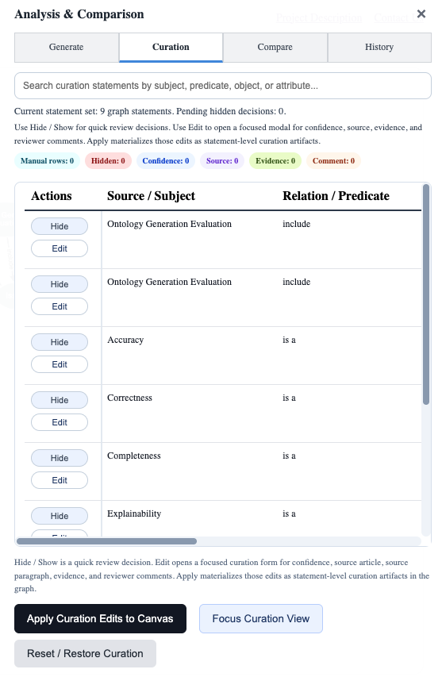
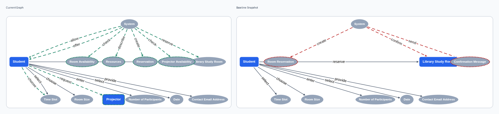

# OntologyWeb screenshots

This folder contains representative screenshots of the OntologyWeb prototype interface and the graph-comparison workflow used in the ICTAI 2026 evaluation artifact.

The screenshots below are intended as a quick visual entry point before inspecting the generated JSON/Turtle graph files and adjudicated evaluation labels.

## 1. Main interface with Settings panel and Generate drawer

This screenshot shows the overall OntologyWeb workspace: the graph canvas, top toolbar, left Settings panel, and right Analysis & Comparison drawer. The Generate tab accepts pasted requirement text or uploaded documents and provides actions for generating either lightweight triple graphs or ontology-compatible Turtle structures through the configured local LLM backend.

## 2. Curation drawer

The Curation tab exposes generated graph statements as reviewable table rows. Users can search statements, hide or restore candidate statements, open focused edit dialogs, and attach review metadata such as source, confidence, evidence, and comments. Applying curation decisions materializes those decisions as statement-level curation artifacts in the graph.

## 3. Representative triple-comparison view

This screenshot shows a representative triple-comparison view for the library-room/projector requirement pair. The comparison view places the current and baseline snapshots side by side and highlights current-only, baseline-only, common, and related change structures. This is the interface behavior evaluated in the requirement-change detection part of the study.

## More comparison screenshots

The complete pair-level visual artifacts are stored under:

- [`../../data/comparison_screenshots/P1/`](../../data/comparison_screenshots/P1/)
- [`../../data/comparison_screenshots/P2/`](../../data/comparison_screenshots/P2/)
- [`../../data/comparison_screenshots/P3/`](../../data/comparison_screenshots/P3/)
- [`../../data/comparison_screenshots/P4/`](../../data/comparison_screenshots/P4/)
- [`../../data/comparison_screenshots/P5/`](../../data/comparison_screenshots/P5/)

P2--P5 include side-by-side triple-comparison and ontology-comparison screenshots where available. For P1, the original side-by-side comparison screenshots were not available, so the folder contains substitute A/B triple and ontology graph-view screenshots for visual inspection.
